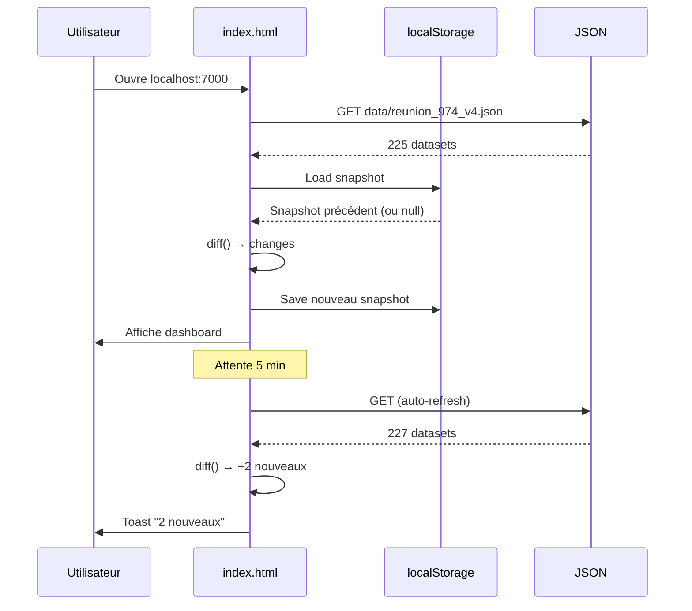

<div align="center">

# 🇷🇪 Monitor UE Réunion

**Monitor de veille open data pour La Réunion (974)**

[](https://github.com/gunout/monitor-ue-reunion/releases)
[](LICENSE)
[](https://github.com/gunout/monitor-ue-reunion)
[](https://github.com/gunout/monitor-ue-reunion)

[](https://developer.mozilla.org/fr/docs/Web/HTML)
[](https://developer.mozilla.org/fr/docs/Web/CSS)
[](https://developer.mozilla.org/fr/docs/Web/JavaScript)

[](http://localhost:7000)
[](https://www.data.gouv.fr)

---

**Surveille automatiquement les datasets open data de l'île de La Réunion.**
Détecte les **nouveaux**, les **mises à jour** et les **disparitions** avec un dashboard temps réel.

[🚀 Démarrage rapide](#-démarrage-rapide) · [✨ Fonctionnalités](#-fonctionnalités) · [🏗️ Architecture](#️-architecture) · [⚙️ Configuration](#️-configuration)

</div>

---

## 📋 Table des matières

- [✨ Fonctionnalités](#-fonctionnalités)
- [🏗️ Architecture](#️-architecture)
- [🚀 Démarrage rapide](#-démarrage-rapide)
- [📦 Structure du projet](#-structure-du-projet)
- [⚙️ Configuration](#️-configuration)
- [🎯 Utilisation](#-utilisation)
- [🔧 Personnalisation](#-personnalisation)
- [🧪 Tests](#-tests)
- [🐳 Déploiement Docker](#-déploiement-docker)
- [🤝 Contribution](#-contribution)
- [📄 Licence](#-licence)
- [🙏 Remerciements](#-remerciements)

---

## ✨ Fonctionnalités

<table>
<tr>
<td width="50%">

### 🔍 Veille continue

- **Auto-refresh** toutes les 5 minutes (configurable)
- **Compte à rebours** visible dans le header
- **Pause automatique** si l'onglet n'est pas visible
- **Reprise instantanée** au retour sur l'onglet

### 📊 Détection intelligente

- 🆕 **Nouveaux datasets** (ajouts)
- 📝 **Mises à jour** (hash différent)
- ❌ **Disparus** (absents du nouveau JSON)
- = **Inchangés** (identiques)

</td>
<td width="50%">

### 🔬 Comparateur de versions

- Vue **Avant / Après** côte à côte
- **Surbrillance** des champs modifiés
- Filtre **"voir seulement les changements"**
- **Copie** de l'état précédent
- **Lien direct** vers la source

### 🏷️ Catégorisation automatique

10 catégories thématiques détectées :

💧 Eau · 🌊 Marin · ⚡ Énergie · 🚌 Transport
🏛️ Administration · ⚠️ Risques · 🌦️ Météo
🎓 Éducation · 🏥 Santé · 🔬 Recherche

</td>
</tr>
</table>

### 🎨 Interface & Ergonomie

| Fonctionnalité | Description |
|----------------|-------------|
| 🎯 **Design DSFR** | Style gouvernemental officiel (bleu EU) |
| 📱 **Responsive** | Mobile, tablette, desktop |
| 🌗 **Palette Réunion** | Bandeau tricolore + doré EU |
| 🔎 **Recherche full-text** | Titre, organisation, tags, description |
| 🎛️ **Filtres combinables** | Catégorie, onglet, tri |
| 📄 **Pagination** | 10/25/50/100 par page |
| 💾 **Persistance locale** | `localStorage` (aucun serveur) |
| 📥 **Export JSON / CSV** | Filtres appliqués |

---

## 🏗️ Architecture

### Vue d'ensemble

```
┌────────────────────────────────────────────────────────────────┐
│                        NAVIGATEUR WEB                          │
│                                                                │
│  ┌──────────────────────────────────────────────────────────┐  │
│  │                    index.html                            │  │
│  │  ┌────────────────┬──────────────────┬─────────────────┐ │  │
│  │  │   SIDEBAR      │     CENTRE       │     DROITE      │ │  │
│  │  │                │                  │                 │ │  │
│  │  │  Catégories    │  Liste datasets  │  Intelligence   │ │  │
│  │  │  thématiques   │  + Filtres       │  + Activité     │ │  │
│  │  │  (10 cat.)     │  + Pagination    │  + Stats        │ │  │
│  │  └────────────────┴──────────────────┴─────────────────┘ │  │
│  └──────────────────────────────────────────────────────────┘  │
│                             ▲                                  │
│                             │ fetch()                          │
│                             │                                  │
│  ┌──────────────────────────┴─────────────────────────────┐    │
│  │              data/reunion_974_v4.json                  │    │
│  │              (généré par le filtre v4)                 │    │
│  └────────────────────────────────────────────────────────┘    │
│                             ▲                                  │
│                             │                                  │
│  ┌──────────────────────────┴─────────────────────────────┐    │
│  │              localStorage (persistance)                │    │
│  │  • monitor974:snapshot      (dernier état)             │    │
│  │  • monitor974:history       (30 derniers comptages)    │    │
│  │  • monitor974:autorefresh   (ON/OFF)                   │    │
│  └────────────────────────────────────────────────────────┘    │
└────────────────────────────────────────────────────────────────┘
```

### Flux de données

```
1. INITIALISATION
   ┌──────────────┐         ┌──────────────┐
   │  Navigateur  │ ──GET──▶│  HTTP Server │
   │  (index.html)│         │  (port 7000) │
   └──────────────┘         └──────┬───────┘
                                   │
                                   │ fetch('data/reunion_974_v4.json')
                                   ▼
                            ┌──────────────┐
                            │  JSON source │
                            │  (225 items) │
                            └──────┬───────┘
                                   │
                                   ▼
2. CHARGEMENT + INDEXATION
   ┌──────────────────────────────────────┐
   │  indexDatasets(data)                 │
   │  ├─ Pour chaque item :               │
   │  │   ├─ Calcule hash (djb2)          │
   │  │   ├─ Détecte catégorie (keywords) │
   │  │   └─ Stocke métadonnées           │
   │  └─ Retourne map {id → dataset}      │
   └──────────────────────────────────────┘
                                   │
                                   ▼
3. COMPARAISON (DIFF)
   ┌──────────────────────────────────────┐
   │  diff(prevSnapshot, newDatasets)     │
   │  ├─ added    : présent dans new      │
   │  │             absent dans prev      │
   │  ├─ updated  : hash différent        │
   │  ├─ removed  : présent dans prev     │
   │  │             absent dans new       │
   │  └─ unchanged: identique             │
   └──────────────────────────────────────┘
                                   │
                                   ▼
4. RENDU
   ┌──────────────────────────────────────┐
   │  • renderStats()                     │
   │  • renderCategories()                │
   │  • renderResults()                   │
   │  • renderCharts()                    │
   └──────────────────────────────────────┘
                                   │
                                   ▼
5. AUTO-REFRESH (toutes les 5 min)
   ┌──────────────────────────────────────┐
   │  AutoRefresh.triggerRefresh()        │
   │  ├─ silentRefresh()                  │
   │  ├─ Compare avant/après              │
   │  └─ Toast si changement              │
   └──────────────────────────────────────┘
```

### Composants principaux

<table>
<tr>
<td width="33%">

#### 🔧 `state`

État global de l'application

```javascript
{
  allDatasets: [],    // tous
  filtered: [],       // filtrés
  changes: null,      // diff
  activeCategories: Set,
  currentTab: 'all',
  search: '',
  page: 1,
  pageSize: 25,
  activities: []
}
```

</td>
<td width="33%">

#### 💾 `Storage`

Persistance localStorage

```javascript
Storage.getSnapshot()
Storage.saveSnapshot(ds)
Storage.clearSnapshot()
Storage.loadHistory()
Storage.pushHistory(entry)
```

</td>
<td width="34%">

#### 🔄 `AutoRefresh`

Polling automatique

```javascript
AutoRefresh.init()
AutoRefresh.tick()
AutoRefresh.triggerRefresh()
AutoRefresh.updateCountdown()
AutoRefresh.showToast()
```

</td>
</tr>
<tr>
<td>

#### 🔬 `DiffViewer`

Comparateur de versions

```javascript
DiffViewer.open(item)
DiffViewer.close()
DiffViewer.render()
DiffViewer.renderCol()
```

</td>
<td>

#### 🎨 `CATEGORIES`

10 catégories thématiques

```javascript
{
  eau: {
    name: 'Eau & Hydrographie',
    flag: '💧',
    keywords: ['eau', 'hydro', ...]
  },
  // ...
}
```

</td>
<td>

#### 🛠️ Fonctions utilitaires

```javascript
escapeHtml(str)
normalize(str)
formatUptime(ms)
formatRelative(iso)
hashDataset(item)
detectCategory(item)
```

</td>
</tr>
</table>

### Cycle de vie d'une exécution



### Stack technique

| Couche | Technologie | Rôle |
|--------|-------------|------|
| **UI** | HTML5 + CSS3 | Structure et style |
| **Style** | DSFR-inspired | Design gouvernemental |
| **Fonts** | Inter + JetBrains Mono | Typographie |
| **Logique** | JavaScript ES6+ | Veille, diff, filtres |
| **Persistance** | `localStorage` | Snapshots + historique |
| **Hash** | djb2 (custom) | Détection changements |
| **Serveur** | `python -m http.server` | Statique (port 7000) |
| **Graphiques** | Barres CSS natives | (pas de dépendance) |

### Choix architecturaux

<table>
<tr>
<td width="50%">

#### ✅ **Client-side pur**

- Aucun backend requis
- Aucune base de données
- Aucune dépendance npm
- Fonctionne hors-ligne (sauf JSON)

#### ✅ **Zéro configuration**

- Un seul fichier HTML
- Un JSON à côté
- `python -m http.server` suffit

</td>
<td width="50%">

#### ⚠️ **Limites assumées**

- `localStorage` : ~5 Mo max
- Pas de partage entre navigateurs
- Pas d'historique côté serveur
- CORS requis si JSON distant

#### 🎯 **Public cible**

- Analystes open data
- Développeurs territoriaux
- Journalistes data
- Citoyens curieux

</td>
</tr>
</table>

---

## 🚀 Démarrage rapide

### Prérequis

- **Python 3.8+** (ou Node.js, PHP, tout serveur HTTP statique)
- Un **navigateur moderne** (Chrome, Firefox, Edge, Safari)
- Un fichier **`data/reunion_974_v4.json`** généré par le filtre v4

### 1️⃣ Cloner le dépôt

```bash
git clone https://github.com/gunout/monitor-ue-reunion.git
cd monitor-ue-reunion
```

### 2️⃣ Placer votre JSON source

```bash
# Créez le dossier data s'il n'existe pas
mkdir -p data

# Copiez votre JSON généré par le filtre v4
cp /chemin/vers/reunion_974_v4.json data/
```

### 3️⃣ Lancer le serveur sur le port 7000

<table>
<tr>
<td>

**🐍 Python (recommandé)**

```bash
python3 -m http.server 7000
```

</td>
<td>

**📦 Node.js**

```bash
npx serve . -l 7000
```

</td>
</tr>
<tr>
<td>

**🐘 PHP**

```bash
php -S localhost:7000
```

</td>
<td>

**⚡ VS Code Live Server**

Configurer dans `settings.json` :

```json
{
  "liveServer.settings.port": 7000
}
```

</td>
</tr>
</table>

### 4️⃣ Ouvrir le dashboard

🌐 **[http://localhost:7000](http://localhost:7000)**

---

## 📦 Structure du projet

```
monitor-ue-reunion/
├── index.html                    # 🎨 Dashboard complet (HTML+CSS+JS)
├── README.md                     # 📖 Ce fichier
├── LICENSE                       # 📄 Licence MIT
├── .gitignore                    # 🚫 Fichiers ignorés
└── data/
    ├── .gitkeep                 # 📌 Préserve le dossier
    └── reunion_974_v4.json      # 📊 Votre JSON source (non versionné)
```

### `.gitignore` recommandé

```gitignore
# Données générées (peuvent être volumineuses)
data/*.json
!data/.gitkeep

# OS
.DS_Store
Thumbs.db

# Éditeurs
.vscode/
.idea/
*.swp
*.swo

# Logs
*.log
logs/

# Node
node_modules/

# Python
__pycache__/
*.py[cod]
.venv/
venv/
```

---

## ⚙️ Configuration

### Modifier l'URL du JSON

Dans `index.html`, cherchez :

```javascript
const JSON_URL = 'data/reunion_974_v4.json';
```

Remplacez par votre chemin :

```javascript
const JSON_URL = 'data/mon_fichier.json';
// ou URL distante (CORS requis)
const JSON_URL = 'https://exemple.com/data/reunion.json';
```

### Modifier l'intervalle d'auto-refresh

Dans `index.html`, cherchez `AutoRefresh` :

```javascript
const AutoRefresh = {
  enabled: JSON.parse(localStorage.getItem('monitor974:autorefresh') ?? 'true'),
  intervalMs: 5 * 60 * 1000,   // ← 5 minutes (modifier ici)
  tickMs: 1000,
  // ...
};
```

**Exemples** :

| Durée | Valeur |
|-------|--------|
| 1 minute | `1 * 60 * 1000` |
| 5 minutes | `5 * 60 * 1000` |
| 15 minutes | `15 * 60 * 1000` |
| 1 heure | `60 * 60 * 1000` |

### Personnaliser les catégories

Cherchez `const CATEGORIES` :

```javascript
const CATEGORIES = {
  eau: {
    name: 'Eau & Hydrographie',
    flag: '💧',
    keywords: ['eau', 'hydro', 'cours', 'riviere', 'bassin', /* ... */],
  },
  // Ajoutez vos catégories ici
};
```

### Changer la palette de couleurs

Cherchez `:root` dans le `<style>` :

```css
:root{
  --reunion-blue: #0066cc;        /* Couleur principale */
  --reunion-volcano: #d94d1e;     /* Accent volcan */
  --green-emeraude: #00a95f;      /* Nouveaux (succès) */
  --yellow-tournesol: #ffb800;    /* Mis à jour (attention) */
  --red-marianne: #E1000F;        /* Disparus (erreur) */
  /* ... */
}
```

---

## 🎯 Utilisation

### 📊 Veille quotidienne

| Action | Comment |
|--------|---------|
| **Voir tous les datasets** | Onglet `📋 Tous` |
| **Voir les nouveaux** | Onglet `🆕 Nouveaux` |
| **Voir les mises à jour** | Onglet `📝 Mis à jour` |
| **Voir les disparus** | Onglet `❌ Disparus` |
| **Voir les graphiques** | Onglet `📊 Graphiques` |
| **Comparer une version** | Cliquer sur une carte mise à jour |
| **Filtrer par catégorie** | Cases à cocher dans la sidebar gauche |
| **Rechercher** | Barre de recherche en haut |
| **Exporter** | Boutons en bas (JSON / CSV) |
| **Forcer un refresh** | Bouton `⟳ Rafraîchir` |
| **Réinitialiser** | Bouton `↺ Reset snapshot` |

### 🔬 Comparateur de versions

**Cliquez sur une carte** mise à jour (ou nouvelle/disparue) pour ouvrir le comparateur :

```
┌─────────────────────────────────────────────────────────────┐
│ 🔍 Comparaison  📝 MISE À JOUR  Nom du dataset              │
├─────────────────────────────────────────────────────────────┤
│ ● Avant    ● Après    🎯 Seulement les changements          │
├──────────────────────────┬──────────────────────────────────┤
│ ─── AVANT ───            │ ─── APRÈS ───                    │
│ Titre : Ancien titre     │ Titre : Nouveau titre       🟡   │
│ URL : .../v1             │ URL : .../v2                🟡   │
│ last_update : 2026-09-15 │ last_update : 2026-10-03    🟡   │
│ Organisation : ...       │ Organisation : ...               │
├──────────────────────────┴──────────────────────────────────┤
│ 📋 Copier l'ancien  │  🌐 Ouvrir la source  │  Fermer     │
└─────────────────────────────────────────────────────────────┘
```

### 📥 Export de données

| Format | Contenu |
|--------|---------|
| **JSON** | Liste filtrée complète avec tous les champs |
| **CSV** | Idem, format tabulaire (id, titre, organisation, catégorie, portail, last_update, change, url) |

Les exports incluent **uniquement les datasets visibles** après filtres.

---

## 🔧 Personnalisation

### Ajouter une catégorie

```javascript
const CATEGORIES = {
  // ... catégories existantes

  nouvelle_cat: {
    name: 'Ma nouvelle catégorie',
    flag: '🎨',
    keywords: ['mot1', 'mot2', 'mot3'],
  },
};
```

### Modifier les champs comparés

Dans `DiffViewer.FIELDS` :

```javascript
FIELDS: [
  { key: 'titre',        label: 'Titre' },
  { key: 'organisation', label: 'Organisation' },
  // Ajoutez / retirez ici
],
```

### Ajouter un bouton d'action

```html
<!-- Dans la section .export-group -->
<button class="export-btn" id="monBouton">🎯 Mon action</button>
```

```javascript
document.getElementById('monBouton').addEventListener('click', () => {
  // Votre code
});
```

---

## 🧪 Tests

### Test manuel

1. **Premier chargement** : tous les datasets apparaissent en 🆕
2. **Clic ⟳ Rafraîchir** : tous passent en `=` (inchangés)
3. **Modifier le JSON** : ajouter un dataset factice
4. **Attendre 5 min** ou cliquer ⟳ → toast apparaît

```bash
# Simuler un ajout dans le JSON
jq '.results += [{
  "id": "test-" + (now | tostring),
  "titre": "Test Dataset 974",
  "portail": "France",
  "organisation": "TestOrg",
  "url": "https://example.com"
}]' data/reunion_974_v4.json > /tmp/test.json
mv /tmp/test.json data/reunion_974_v4.json
```

### Vérifier la console navigateur

Ouvrez la console (`F12`) pour voir :

```
[Monitor 974] Dashboard chargé sur http://localhost:7000
[AutoRefresh] Reprise après inactivité, refresh immédiat
[AutoRefresh] Aucun changement
```

---

## 🐳 Déploiement Docker

### `Dockerfile`

```dockerfile
FROM nginx:alpine

COPY . /usr/share/nginx/html/
EXPOSE 7000

RUN sed -i 's/listen\s*80;/listen 7000;/' /etc/nginx/conf.d/default.conf

CMD ["nginx", "-g", "daemon off;"]
```

### `docker-compose.yml`

```yaml
version: '3.8'

services:
  monitor:
    build: .
    container_name: monitor-ue-reunion
    ports:
      - "7000:7000"
    volumes:
      - ./data:/usr/share/nginx/html/data:ro
    restart: unless-stopped
    environment:
      - TZ=Indian/Reunion
```

### Lancement

```bash
docker-compose up -d
# → http://localhost:7000
```

---

## 🤝 Contribution

Les contributions sont **les bienvenues** !

### Workflow

1. **Fork** le dépôt
2. Créez une **branche** : `git checkout -b feature/ma-fonctionnalite`
3. **Committez** : `git commit -m "feat: ajout de ma fonctionnalité"`
4. **Poussez** : `git push origin feature/ma-fonctionnalite`
5. Ouvrez une **Pull Request**

### Convention de commits

Ce projet utilise [Conventional Commits](https://www.conventionalcommits.org/) :

| Type | Description |
|------|-------------|
| `feat` | Nouvelle fonctionnalité |
| `fix` | Correction de bug |
| `docs` | Documentation |
| `style` | Formatage (pas de code) |
| `refactor` | Refactoring |
| `test` | Ajout de tests |
| `chore` | Maintenance |

### Signaler un bug

Ouvrez une [issue](https://github.com/gunout/monitor-ue-reunion/issues) avec :

- Description du problème
- Étapes de reproduction
- Navigateur + version
- Captures d'écran si pertinent

---

## 📄 Licence

Ce projet est sous licence **MIT** — voir le fichier [LICENSE](LICENSE) pour plus de détails.

```
MIT License

Copyright (c) 2026 gunout

Permission is hereby granted, free of charge, to any person obtaining a copy
of this software and associated documentation files (the "Software"), to deal
in the Software without restriction, including without limitation the rights
to use, copy, modify, merge, publish, distribute, sublicense, and/or sell
copies of the Software, and to permit persons to whom the Software is
furnished to do so, subject to the following conditions:

The above copyright notice and this permission notice shall be included in all
copies or substantial portions of the Software.

THE SOFTWARE IS PROVIDED "AS IS", WITHOUT WARRANTY OF ANY KIND, EXPRESS OR
IMPLIED, INCLUDING BUT NOT LIMITED TO THE WARRANTIES OF MERCHANTABILITY,
FITNESS FOR A PARTICULAR PURPOSE AND NONINFRINGEMENT. IN NO EVENT SHALL THE
AUTHORS OR COPYRIGHT HOLDERS BE LIABLE FOR ANY CLAIM, DAMAGES OR OTHER
LIABILITY, WHETHER IN AN ACTION OF CONTRACT, TORT OR OTHERWISE, ARISING FROM,
OUT OF OR IN CONNECTION WITH THE SOFTWARE OR THE USE OR OTHER DEALINGS IN THE
SOFTWARE.
```

---

## 🙏 Remerciements

Ce projet utilise les données et ressources suivantes :

<table>
<tr>
<td align="center" width="25%">

### 🇫🇷 data.gouv.fr

[](https://www.data.gouv.fr)

Portail open data français

</td>
<td align="center" width="25%">

### 🇪🇺 data.europa.eu

[](https://data.europa.eu)

Portail open data européen

</td>
<td align="center" width="25%">

### 🏛️ DSFR

[](https://www.systeme-de-design.gouv.fr)

Système de design de l'État

</td>
<td align="center" width="25%">

### 🎨 Inter + JetBrains Mono

[](https://fonts.google.com)

Typographie moderne

</td>
</tr>
</table>

### Organismes producteurs de données

- **[IFREMER](https://www.ifremer.fr)** — Institut français de recherche pour l'exploitation de la mer
- **[Shom](https://www.shom.fr)** — Service hydrographique et océanographique de la Marine
- **[SANDRE](https://www.sandre.eaufrance.fr)** — Système d'information sur l'eau
- **[BRGM](https://www.brgm.fr)** — Bureau de recherches géologiques et minières
- **[EDF SEI](https://www.edf.fr)** — Systèmes énergétiques insulaires
- **[Météo-France](https://meteofrance.com)** — Météorologie nationale
- **[Région Réunion](https://www.regionreunion.com)** — Collectivité régionale

---

<div align="center">

**⭐ Si ce projet vous est utile, n'hésitez pas à lui mettre une étoile !**

[🐛 Signaler un bug](https://github.com/gunout/monitor-ue-reunion/issues) ·
[💡 Proposer une idée](https://github.com/gunout/monitor-ue-reunion/issues) ·
[🔀 Contribuer](https://github.com/gunout/monitor-ue-reunion/pulls)

---

Fait avec ❤️ pour La Réunion 🇷🇪

**[⬆ Retour en haut](#-monitor-ue-réunion)**

</div>
